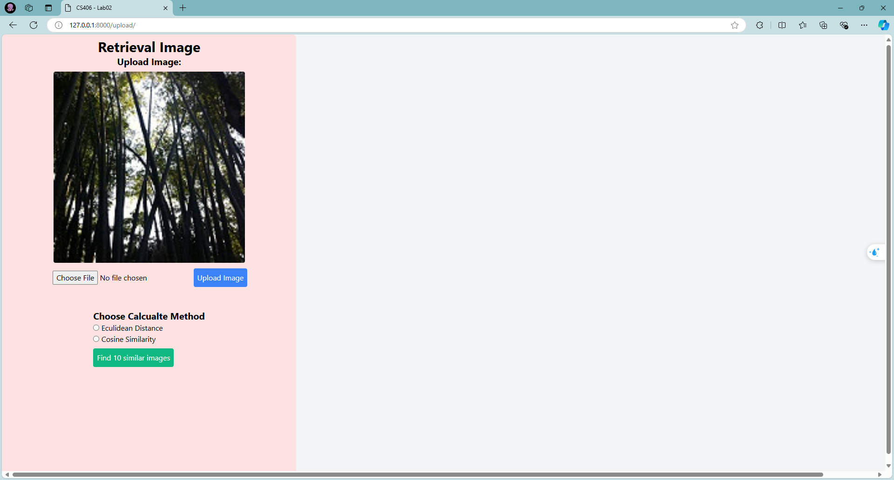
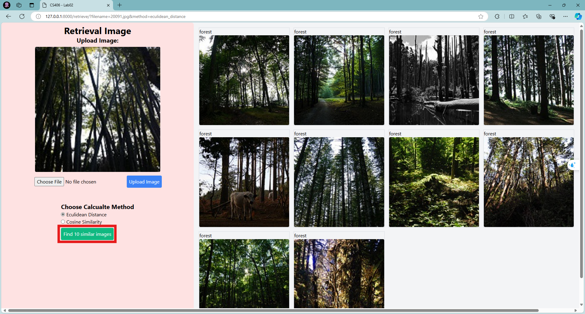

## HOW TO RUN
1. Install all dependencies:
````bash
pip install -r requirements.txt
````
2. Download Dataset and place in "static/dataset/". Link: https://drive.google.com/file/d/1F6sPtl0H-Sh7XPrAojDKcz_rBoUl_fgu/view?usp=sharing

3. Run server:
````bash
uvicorn app:app
````

## HOW TO USE
1. Upload an query image:


2. Choose an calculate methods and Find 10 images:


Link repo: 