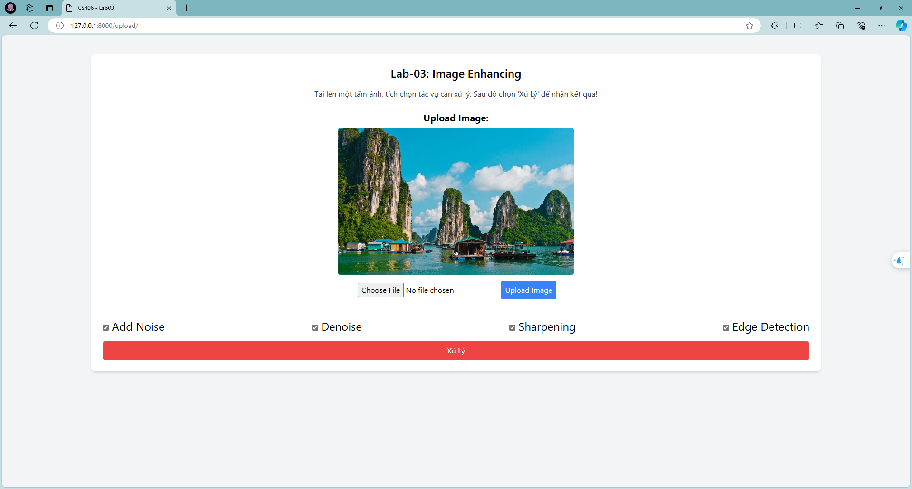
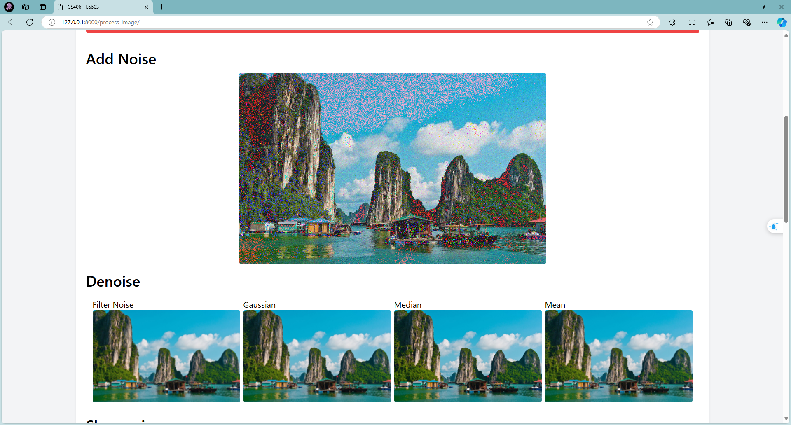
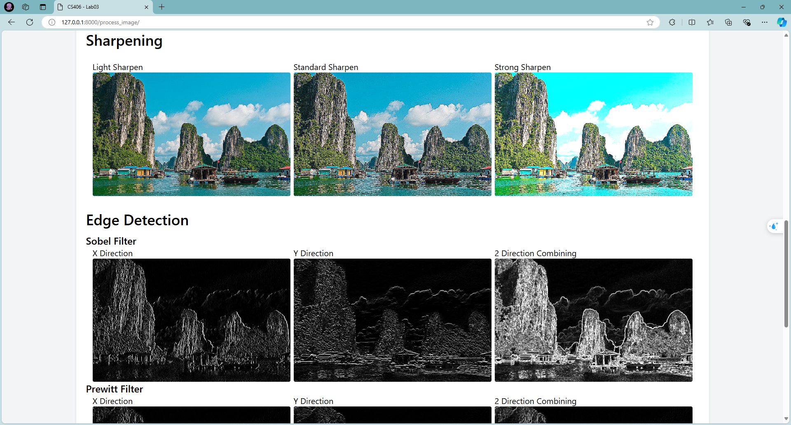
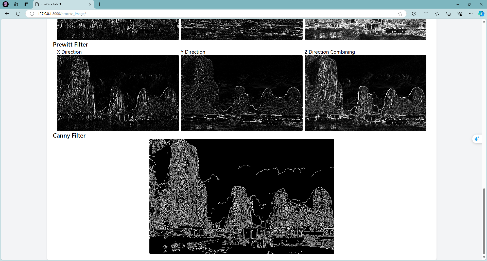

## HOW TO RUN
1. Install all dependencies:
````bash
pip install -r requirements.txt
````
2. Run server:
````bash
uvicorn app:app
````

## HOW TO USE
1. Upload an input image:


2. Choose tasks and click 'Xu Ly':



